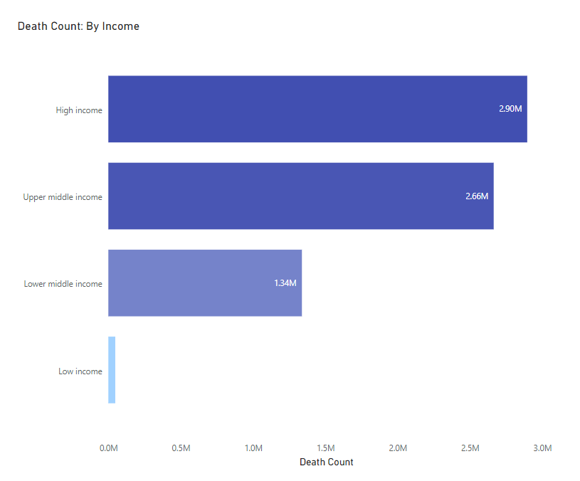

# Introduction
In this project I explore the global data on covid 19 to gain valuable insights into the data.

The SQL queries can be seen here: [project_sql folder](/project_sql/)

# Background

In this analysis I analyze the available data on covid 19 deaths and vaccinations to unearth valuable insights into the covid infections, deaths, vacciantions, repoduction rate, etc across the globe.
The insights will help the readers/stakeholder to understand the probability of dying in variaous courtries and regions, the likelihood of contracting infection across countries / regions, the total deaths by countries / regions, reproductions rate across the countries / regions during the pandemic, and rolling people vaccinated across different location during the pandemic. 

The data can be downloaded from here: [Covid_deaths](), [Covid_vacci](). 
If contains information on deaths, vaccination and others by country, regions/continents, and income grouping, from 2020 to 2023.


### The questions I wanted to answer through SQL queries are:

1. What is the likelihood of dying across different countries, countinents and by income during the pandemic?
2. What is the likelihood of contracting infection by year during the pandemic?
3. What is the probability of contracting covid infection by months of year during the pandemic?
4. What is the pobability of dying by years during the pandemic/
5. What is the probability of dying by months of year during the pandemic?
6. What is the percentage of population infected by country, continenents and income group?
7. What is the total number of deaths due to covid infection by country, continent and income group during the pandemic?
8. What is the reproduction rate in the countries, continents and income groups during the pandemic?
9. What is percentage of pupulation that is vaccianted by country, continent, and income group?
10. What is the percentage of population vaccinated during the successive years during the pandemic?

# Tools Used
For analyzing the data to answer the questions I used the following tools:

- **SQL:** It allowed me to create the tables/database, import the data into the tables, and perform various operations on the data.
- **PostgreSQL:** This database management system, was chosen for handling exploring, and analyzing the data.
- **Microsoft Power BI:** For visualizing the output of the SQL queries.
- **Visual Studio Code:** For executing SQL queries.

# Analysis
The database was created and analyzed to investigate different aspects of the data to answer the above-mentioned questions.:


## 1. Likelihood of Dying by Location

### i. By Country

#### a. Top 10 Countries
To identify the top 10 countries having the highest probability of dying dues to covid, I delveloped and calculated a new metric death_percentage by country. Then I filtered out the null values in the contnent, and the total_deaths column.


For getting information on the top 10 countries I grouped the data on countries and ordered the output by descending order while for bottom 10 I ordered it by ascending order.


```sql
SELECT
    location AS country,
    MAX(CAST(total_cases AS INTEGER)) AS total_cases,
    MAX(CAST(total_deaths AS INTEGER)) AS total_deaths,
    MAX(CAST(total_deaths AS FLOAT)) * 100 / MAX(CAST(total_cases AS FLOAT)) AS death_percentage_country
FROM
    covid_deaths
WHERE
    continent IS NOT NULL AND 
	total_deaths IS NOT NULL
GROUP BY
    location
ORDER BY
    4 DESC
LIMIT 10;
```

- **Query Result**

    | country     	 		|  total_cases  | 	total_deaths| death_percentage_country	|
    |-----------------------|---------------|---------------|---------------------------|
    | Yemen					|	11945			|	2159	|	18.07		            |
    | Sudan					|	63993			|	5046	|	7.88		            |
    | Syria					|	57423			|	3163	|	5.51		            |
    | Somalia				|	27334			|	1361	|	4.98		            |
    | Peru					|	4514682			|	221203	|	4.90		            |
    | Egypt					|	516023			|	24830	|	4.81		            |
    | Mexico				|	7633355			|	334336	|	4.38		            |
    | Bosnia and Herzegovina|	403052			|	16352	|	4.06		            |
    | Liberia				|	8090			|	294		|	3.63		            |
    | Afghanistan			|	223846			|	7932	|	3.54		            |

**Visual**

![Top_10_Countries][def]

[def]: power_bi_visualizations/2_dying_likelihood_by_country_top_10.png

*The bar chart visualizes the top 10 countries having the highest probability of dying due to covid.*

**Insights:**
The output offer the following top 4 insights

- ***Yemen:*** Yemen has the highest death percentage among the listed countries, standing at approximately 18.07%. Despite a relatively lower total number of cases, the impact of COVID-19 on Yemen's population in terms of fatalities is significant, indicating potential challenges in healthcare infrastructure and response measures.

- ***Sudan:*** Sudan follows Yemen with a death percentage of around 7.89%. Despite having a higher total number of cases compared to Yemen, Sudan's death percentage is lower, suggesting a relatively better outcome in terms of fatalities compared to the total number of cases.

- ***Syria:*** Syria ranks third in terms of death percentage, with approximately 5.51%. While lower than Yemen and Sudan, Syria still faces a notable impact from COVID-19, with a significant proportion of cases resulting in fatalities.

- ***Somalia:*** Somalia occupies the fourth position in terms of death percentage, standing at around 4.98%. Despite challenges, including healthcare infrastructure limitations, Somalia demonstrates a lower fatality rate compared to some other countries in the dataset, indicating potential resilience and effective response measures within the country.
These insights highlight the varying impacts of COVID-19 across different countries, influenced by factors such as healthcare infrastructure, response measures, and population demographics.


#### b. Bottom 10 Countries
To identify the bottom 10 countries having the lowest probability of dying dues to covid, I delveloped and calculated a new metric death_percentage by country. Then I filtered out the null values in the contnent, and the total_deaths column.


For getting the bottom 10 countries I grouped the data by countries and ordered the output by descending order while for bottom 10 I ordered it by ascending order.


```sql
SELECT
    location AS country,
    MAX(CAST(total_cases AS INTEGER)) AS total_cases,
    MAX(CAST(total_deaths AS INTEGER)) AS total_deaths,
    MAX(CAST(total_deaths AS FLOAT)) * 100 / MAX(CAST(total_cases AS FLOAT)) AS death_percentage_country
FROM
    covid_deaths
WHERE
    continent IS NOT NULL AND 
	total_deaths IS NOT NULL
GROUP BY
    location
ORDER BY
    4 ASC
LIMIT 10;
```

- **Query Result**

    | country     	 				|  total_cases  | 	total_deaths| death_percentage_country	|
    |-------------------------------|---------------|---------------|---------------------------|
    | 	Nauru						|	5393		|		1		|	0.02	                |
    | 	Burundi						|	54229		|		15		|	0.03		            |
    | 	Cook Islands				|	7148		|		2		|	0.03	                |
    | 	Bhutan						|	62690		|		21		|	0.03		            |
    | 	Tuvalu						|	2943		|		1		|	0.03		            |
    | 	Brunei						|	309561		|		162		|	0.05		            |
    | 	Saint Pierre and Miquelon	|	3426		|		2		|	0.06		            |
    |  	Tonga						|	16819		|		12		|	0.07		            |
    | 	Singapore					|	2519716		|		1841	|	0.07		            |
    | 	Faeroe Islands				|	34658		|		28		|	0.08		            |


**Visual**


*The bar chart visualizes 10 countries having the lowest probability of dying due to covid.*


**Insights:**
The output offer the following top 4 insights

- ***Nauru:*** Nauru has the lowest death percentage among the listed countries, standing at approximately 0.0185%. With only one reported death and a relatively low total number of cases, Nauru demonstrates a remarkable ability to contain the impact of COVID-19 within its population.

- ***Burundi:*** Burundi follows Nauru with a death percentage of around 0.0277%. Despite a higher total number of cases compared to Nauru, Burundi's death percentage remains low, indicating effective management of the virus within the country.

- ***Cook Islands:*** The Cook Islands rank third in terms of low death percentage, with approximately 0.028%. With only two reported deaths and a relatively low total number of cases, the Cook Islands have managed to keep the impact of COVID-19 minimal within its population.

- ***Bhutan:*** Bhutan occupies the fourth position in terms of low death percentage, standing at around 0.0335%. Despite a higher total number of cases compared to the previous countries listed, Bhutan's death percentage remains relatively low, suggesting effective measures in controlling the spread of the virus and minimizing fatalities.


### ii. By Continent

To identify the continent having the highest likelihood of dying due to covid, I developed and calculated a death_percentage metric. Then I filtered all other locations except the continents.

Then in grouped the data one contienet and ordered it in descending order.


```sql
SELECT
    continent,
    MAX(CAST(total_cases AS INTEGER)) AS total_cases,
    MAX(CAST(total_deaths AS INTEGER)) AS total_deaths,
    MAX(CAST(total_deaths AS float)) * 100 / max(CAST(total_cases AS float)) AS Death_Percentage_Country
FROM
    Covid_deaths
WHERE
    continent IS NOT NULL
GROUP BY 
    continent
ORDER BY
    4 DESC;
```

 **Query Result**

| country  | total_cases  | total_deaths  | death_pecentage_country   |
|----------|--------------|---------------|---------------------------|
| Africa		|	4072533		|	102595		|	12.52		            |
| South America	|	37693506	|	704320		|	1.87		            |
| North America	|	103436829	|	1127152		|	1.09		            |
| Europe		|	38997490	|	399772		|	1.02		            |
| Asia			|	99665881	|	531915		|	0.53		            |
| Oceania		|	11527289	|	22200		|	0.19		            |   

	
**Visual**


*The bar chart visualizes the probability of dying across continent,of covid-19 if infected.*

**Insights:**
The output offer the following top 4 insights

- **North America:** Despite having the lowest total number of cases among the listed continents, North America has the highest death percentage at approximately 1.09%. This indicates a significant impact of COVID-19 on the population of North America, with a relatively high proportion of cases resulting in fatalities.

- **Africa:** Africa has a higher total number of cases compared to North America, but a lower death percentage at approximately 2.52%. This suggests that while the total number of cases is substantial, the proportion of fatalities relative to the total cases is comparatively lower in Africa.

- **South America:** South America has a death percentage of approximately 1.87%, indicating a significant impact of COVID-19 on the population of the continent. With a high total number of cases and a relatively higher death percentage, South America faces considerable challenges in managing the pandemic.

- **Asia:** Asia has the highest total number of cases among the listed continents, but the lowest death percentage at approximately 0.53%. Despite the large number of cases, the proportion of fatalities relative to the total cases is relatively low in Asia compared to other continents, suggesting effective containment measures or possibly other factors contributing to lower mortality rates.

- **Europe:** Europe has a death percentage of approximately 1.03%, indicating a significant impact of COVID-19 on the continent's population. With a high total number of cases and a relatively higher death percentage, Europe faces challenges in managing the pandemic and minimizing fatalities.

- **Oceania:** Oceania has the lowest death percentage among the listed continents at approximately 0.19%. This indicates a relatively lower impact of COVID-19 on the population of Oceania compared to other continents, with a small proportion of cases resulting in fatalities.


### iii. By Income Grouping

To analyze the probability of dying due to covid in case of countries by income, I developed and calculated a death_percentage metric, filtered and grouped the data by income. 


```sql
SELECT
    location,
    MAX(CAST(total_cases AS INTEGER)) AS total_cases,
    MAX(CAST(total_deaths AS INTEGER)) AS total_deaths,
    MAX(CAST(total_deaths AS FLOAT)) * 100 / MAX(CAST(total_cases AS FLOAT)) AS Death_Percentage_Country
FROM
    Covid_deaths
WHERE
    continent IS NULL AND 
	location IN ('High income', 'Upper middle income', 'Lower middle income', 'Low income')
GROUP BY 
    location
ORDER BY
    4 DESC;
```

**Query Result**

| country  		        |  total_cases  | 	total_deaths| death_percentage_country	|
|-----------------------|---------------|---------------|---------------------------|
| Low income		    |	2312361	    |	47962		|	2.07		|
| Lower middle income  	|	97438372	|	1338556		|	1.37		|
| Upper middle income 	|	244177822	|	2664652		|	1.09		|
| High income		    |	423096646	|	2896542		|	0.68		|
	
**Visual**


*The bar chart visualizes the probability of dying across continent,of covid-19 if infected.*

**Insights:**
The output offer the following top 4 insights

- **High Income Countries:** High-income countries have the highest total number of cases among the listed income groups, with approximately 423 million cases. However, despite the high number of cases, the death percentage for high-income countries is relatively low at around 0.68%. This suggests that high-income countries have been more effective in managing the impact of COVID-19 on mortality rates compared to other income groups.

- **Upper Middle Income Countries:** Upper middle-income countries have a substantial total number of cases, approximately 244 million, which is the second-highest among the listed income groups. The death percentage for upper middle-income countries is around 1.09%, indicating a moderate impact of COVID-19 on mortality rates in these countries.

- **Lower Middle Income Countries:** Lower middle-income countries have the highest total number of cases among the listed income groups, with approximately 97 million cases. The death percentage for lower middle-income countries is around 1.37%, indicating a relatively higher impact of COVID-19 on mortality rates compared to upper middle and high-income countries.

- **Low Income Countries:** Low-income countries have the lowest total number of cases among the listed income groups, with approximately 2.3 million cases. However, the death percentage for low-income countries is relatively high at around 2.07%, indicating a significant impact of COVID-19 on mortality rates despite the lower total number of cases. This suggests potential challenges in healthcare infrastructure and response measures in low-income countries.


## 2. Likelihood of Infection By Year

Here I want to analyze the tend of infection rate over the years. For doing so I developed and executed the following SQL query.


```sql
SELECT
    EXTRACT(YEAR FROM date) AS year,
    ROUND((AVG(CAST(new_cases AS INTEGER) / CAST(total_cases AS INTEGER)) * 100), 2) AS infection_rate_year
FROM 
	Covid_deaths
WHERE 
	continent IS NOT NULL
GROUP BY
    EXTRACT(YEAR FROM date)
ORDER BY 
	2 DESC;
```

 **Query Result**

| year 		|  infection_rate_year  |
|-----------|-----------------------|
| 2020	    |	0.34	            |
| 2022  	|	0.01	            |
| 2021  	|	0.00	            |
| 2023	    |	0.00	            |	

**Visual**


*The bar chart visualizes the probability of contracting covid infection across the years.*


**Insights:**
The output offer the following top 4 insights

- **2020:** In 2020, the infection rate was relatively high at 0.342 percent. This indicates a significant spread of infections during that year, likely corresponding to the early stages of the COVID-19 pandemic when transmission rates were high and preventative measures were still being established in many parts of the world.

- **2021:** The infection rate decreased substantially in 2021 to 0.005 percent. This suggests a significant improvement in controlling the spread of the virus compared to the previous year, possibly due to the implementation of public health measures, vaccination campaigns, and increased awareness about preventive measures.

- **2022:** The infection rate further declined in 2022 to 0.011. This indicates continued progress in managing the pandemic, with further reductions in transmission rates likely attributed to the widespread adoption of preventive measures and vaccination efforts.

- **2023:** In 2023, the infection rate reached its lowest point at 0.000, indicating no reported infections during that year. This suggests a remarkable achievement in controlling the spread of COVID-19, possibly due to high vaccination coverage, effective public health interventions, and the development of immunity within the population.


Overall, the data demonstrates a trend of declining infection rates over the years, reflecting successful efforts in controlling the spread of COVID-19 and mitigating its impact on public health.


## 3. Likelihood of Infection By Months of Year

To gain highlight the varying levels of transmission of COVID-19 across different months, with peaks and troughs reflecting fluctuations in infection rates over time the following SQL query was developed and excuted.
In the query the "month_number" column was extractd which was later on used for sorting the "month" column for effective visualization.

```sql
SELECT
   CASE
        WHEN EXTRACT(MONTH FROM date) = 1 THEN 'Jan'
        WHEN EXTRACT(MONTH FROM date) = 2 THEN 'Feb'
        WHEN EXTRACT(MONTH FROM date) = 3 THEN 'Mar'
        WHEN EXTRACT(MONTH FROM date) = 4 THEN 'Apr'
        WHEN EXTRACT(MONTH FROM date) = 5 THEN 'May'
        WHEN EXTRACT(MONTH FROM date) = 6 THEN 'Jun'
        WHEN EXTRACT(MONTH FROM date) = 7 THEN 'Jul'
        WHEN EXTRACT(MONTH FROM date) = 8 THEN 'Aug'
        WHEN EXTRACT(MONTH FROM date) = 9 THEN 'Sep'
        WHEN EXTRACT(MONTH FROM date) = 10 THEN 'Oct'
        WHEN EXTRACT(MONTH FROM date) = 11 THEN 'Nov'
        ELSE 'Dec'
        END AS month,
    EXTRACT(MONTH FROM date) AS month_number,
    ROUND((AVG(CAST(new_cases AS INTEGER) / CAST(total_cases AS INTEGER)) * 100), 3) AS infection_rate_monthwise
FROM 
	Covid_deaths
WHERE 
	continent IS NOT NULL
GROUP BY
	EXTRACT(MONTH FROM date)
ORDER BY 
	3 desc;
```

- **Query Result**

    | year 		|  month_number |   infection_rate_monthwise    |
    |-----------|---------------|-------------------------------|
    | Jan	    |	1	        |       0.114                   |
    | Feb     	|	2           |       0.167                   |    
    | Mar  	    |   3  	        |       0.579                   |
    | Apr       |	4           |       0.041                   |
    | May       |	5           |       0.018                   |
    | Jun       |	6           |       0.004                   |
    | Jul       |	7           |       0.004                   |
    | Aug       |	8           |       0.010                   |
    | Sep       |	9          	|       0.005                   |
    | Oct       |	10         	|       0.024                   |
    | Nov       |	11       	|       0.005                   |                    
    | Dec       |	12     	    |       0.010                   |

**Visual**


*The bar chart visualizes the probability of contracting covid infection by months of year.*

**Insights:**

- **March (Mar):** March had the highest infection rate among the months, with a rate of 0.579. This indicates a significant increase in infections during March, possibly corresponding to a period of heightened transmission and the spread of COVID-19.

- **February (Feb):** February had the second highest infection rate at 0.167. While lower than March, this still indicates a substantial level of transmission during February, suggesting that COVID-19 was already spreading significantly at this point.

- **January (Jan):** January had a relatively high infection rate at 0.114, indicating early transmission of COVID-19 during the beginning of the year. This likely represents the initial stages of the pandemic when cases were starting to emerge and spread globally.

- **April (Apr):** April had a relatively low infection rate at 0.041, indicating a decrease in transmission compared to the previous months. This could be attributed to the implementation of public health measures and interventions aimed at reducing the spread of the virus.


Overall, the data demonstrates a trend of declining infection rates over the years, reflecting successful efforts in controlling the spread of COVID-19 and mitigating its impact on public health.


## 4. Likelihood of Infection By Quarter of Year

To gain highlight the varying levels of transmission of COVID-19 across different quarters of the the following SQL query was developed and excuted.

```sql
SELECT
    EXTRACT(QUARTER FROM date) AS quarter_year,
    ROUND((AVG(CAST(new_cases AS INTEGER) / CAST(total_cases AS INTEGER)) * 100), 3) AS infection_rate
FROM 
	Covid_deaths
WHERE 
	continent IS NOT NULL
GROUP BY
    EXTRACT(QUARTER FROM date) 
ORDER BY 
	1 ASC;
```

- **Query Result**

    | quarter_year  |   infection_rate  |
    |---------------|-------------------|
    | 1	            |       0.308       |
    | 2     	    |       0.021       |    
    | 3  	        |       0.006       |
    | 4             |       0.013       |
    

**Insights:**
The output shows that the infection rate is the highest in the the first quarter followed by the second quarter. It reaches its lowest in the third quater then rising again in the 4th quarter of the year.


## 5. Probability of Dying by Year

Here I want to gain insight into the probability of dying due to covid infection over the years. For doing so I developed and executed the following SQL query.

```sql
    SELECT
        EXTRACT(YEAR FROM date) AS year,
        ROUND(AVG(CAST(total_deaths AS INTEGER) / CAST(total_cases AS INTEGER) * 100), 2) AS death_rate
    FROM 
        Covid_deaths
    WHERE 
        continent IS NOT NULL
    GROUP BY 
        EXTRACT(YEAR FROM date)        
    ORDER BY 
        2 DESC;
```

**Query Result**

| year 		|   death_rate  |
|-----------|---------------|
| 2020	    |	67.04	    |
| 2022  	|	0.00	    |
| 2021  	|	0.00	    |
| 2023	    |	0.00	    |	


**Visual**


*The chart visualizes the probability of dying due to covid across the years.*


**Insights:**

- In 2020, the death percentage was 67.04%. This is unusually high and suggests a significant event or anomaly affecting mortality rates that year.


- In 2021, 2022, and 2023, the death percentage is listed as 0.00%. This could indicate either a data anomaly or a deliberate representation of no deaths recorded in those years.


Without further context, it's challenging to interpret why the death percentage dropped to 0.00% in the subsequent years. It could be due to improvements in healthcare, changes in reporting methods, or simply an error in data collection or presentation. 


## 6. Probability of Dying by Months of Year

To gain insights into the probability of dying if infected with Covid across different months, with peaks and troughs reflecting fluctuations in death rates over time the following SQL query was developed and excuted.
In the query the "month_number" column was extractd which was later on used for sorting the "month" column for effective visualization.

```sql
SELECT
    CASE
        WHEN EXTRACT(MONTH FROM date) = 1 THEN 'Jan'
        WHEN EXTRACT(MONTH FROM date) = 2 THEN 'Feb'
        WHEN EXTRACT(MONTH FROM date) = 3 THEN 'Mar'
        WHEN EXTRACT(MONTH FROM date) = 4 THEN 'Apr'
        WHEN EXTRACT(MONTH FROM date) = 5 THEN 'May'
        WHEN EXTRACT(MONTH FROM date) = 6 THEN 'Jun'
        WHEN EXTRACT(MONTH FROM date) = 7 THEN 'Jul'
        WHEN EXTRACT(MONTH FROM date) = 8 THEN 'Aug'
        WHEN EXTRACT(MONTH FROM date) = 9 THEN 'Sep'
        WHEN EXTRACT(MONTH FROM date) = 10 THEN 'Oct'
        WHEN EXTRACT(MONTH FROM date) = 11 THEN 'Nov'
        ELSE 'Dec'
        END AS month,
    EXTRACT(MONTH FROM date) AS month_number,
    ROUND((AVG(CAST(total_deaths AS INTEGER) / CAST(total_cases AS INTEGER)) * 100), 2) AS Death_Percentage_monthwise
FROM 
	Covid_deaths
WHERE 
	continent IS NOT NULL
GROUP BY 
	EXTRACT(MONTH FROM date)
ORDER BY 
	2 ASC;
```

- **Query Result**

    | year 		|  month_number |   death_percentage_monthwise  |
    |-----------|---------------|-------------------------------|
    | Jan	    |	1	        |       0.41                   |
    | Feb     	|	2           |       0.04                   |    
    | Mar  	    |   3  	        |       4.14                   |
    | Apr       |	4           |       73.79                   |
    | May       |	5           |       63.45                   |
    | Jun       |	6           |       0.14                   |
    | Jul       |	7           |       0.02                   |
    | Aug       |	8           |       0.00                   |
    | Sep       |	9          	|       0.00                   |
    | Oct       |	10         	|       0.00                   |
    | Nov       |	11       	|       0.00              |                    
    | Dec       |	12     	    |       0.00                   |


**Visual**


*The line chart visualizes the probability of dying due to covid by months of year.*

**Insights:**

- **Monthly Fluctuations:** The death percentage varies significantly from month to month. While some months have very low percentages (0.00% to 0.14%), others experience extremely high percentages (73.79% in April and 63.45% in May).

- **Peak in Mortality:** April and May stand out as months with exceptionally high death percentages, indicating a significant increase in mortality rates during these periods. This could suggest a peak in COVID-19 infections or other related factors contributing to higher mortality rates.

- **Seasonal Trends:** There seems to be a trend of increased mortality during the spring months (March to May), followed by a rapid decline in mortality from June onwards. This could potentially reflect the impact of seasonal variations on COVID-19 transmission and severity.

- **Overall Decrease:** After the peak months of April and May, mortality percentages sharply decline and remain consistently low from June to December. This downward trend suggests successful interventions or changes in circumstances that mitigate the impact of COVID-19 on mortality rates.


## 7. Probability of Dying By Quarter of Year


To gain highlight the varying levels of deahts due to COVID-19 across different quarters of the the following SQL query was developed and excuted.

```sql
SELECT
    EXTRACT(QUARTER FROM date) AS quarter_year,
    ROUND((AVG(CAST(total_deaths AS INTEGER) / CAST(total_cases AS INTEGER)) * 100), 2) AS Death_Percentage
FROM 
	Covid_deaths
WHERE 
	continent IS NOT NULL
GROUP BY 
     EXTRACT(QUARTER FROM date) 
ORDER BY 
	1 ASC;
```

- **Query Result**

    | quarter_year  |   infection_rate  |
    |---------------|-------------------|
    | Jan	        |       1.65        |
    | Feb     	    |       45.54       |    
    | Mar  	        |       0.01        |
    | Apr           |       0.00        |
   

**Insights:**

The output shows that if infected with covid then the chances of dying are the highest in the second quarter (45 percent) followed by Q1, Q3, and Q4 respectively.


## 8. Number of Deaths by Location

### i. By Country

#### a. Top 10 Countries

To identify the top 10 countries having the highest number of deaths due to covid, I filtered out the null values in the contnent, and the total_deaths column.


For getting information on the top 10 countries I grouped the data on countries and ordered the output by descending order.


```sql
SELECT 
	Location AS country, 
	MAX(CAST(total_deaths AS INTEGER)) AS Total_death_count
FROM 
	Covid_deaths
WHERE
	continent IS NOT NULL AND
    total_deaths IS NOT NULL
GROUP BY 
	Location
ORDER BY 
	Total_death_count DESC
LIMIT 10;
```

- **Query Result**

    | country     	 	|  total_death_count  |
    |-------------------|---------------------|
    | United States		|	1127152			|
    | Brazil			|	704320			|
    | India				|	531915			|
    | Russia			|	399772			|
    | Mexico			|	334336			|
    | United Kingdom	|	228144			|
    | Peru				|	221203			|
    | Italy             |	190942		    |
    | Germany			|	174979			|
    | France			|	167985			|

**Visual**


*The bar chart visualizes the top 10 countries having the highest number of deaths due to covid.*

**Insights:**

- **United States:** Leads in total death count with 1,127,152 deaths. This reflects the significant impact of the pandemic in the country.

- **Brazil:** Follows the United States with 704,320 deaths. 

- **India:** Ranks third with 531,915 deaths.

- **Russia, Mexico, United Kingdom, Peru, Italy, Germany, and France:** These countries also have significant death counts, ranging from 399,772 deaths in Russia to 167,985 deaths in France. 

- **Policy Responses:** The differences in death counts between countries may reflect variations in government responses, healthcare infrastructure, vaccination rates, and other factors influencing the spread and severity of COVID-19.


#### b. Bottom 10 Countries

To identify the top 10 countries having the highest number of deaths due to covid, I filtered out the null values in the contnent, and the total_deaths column.


For getting information on the top 10 countries I grouped the data on countries and ordered the output by ascending order.


```sql
SELECT 
	Location AS country, 
	MAX(CAST(total_deaths AS INTEGER)) AS Total_death_count
FROM 
	Covid_deaths
WHERE
	continent IS NOT NULL AND
    total_deaths IS NOT NULL
GROUP BY 
	Location
ORDER BY 
	Total_death_count ASC
LIMIT 10;
```

**Query Result**

| country     	 	        |  total_death_count|
|---------------------------|-------------------|
| Nauru	                    |	1			    |
| Tuvalu			        |	1			    |
| Saint Pierre and Miquelon	|	2			    |
| Cook Islands			    |	2			    |
| Saint Barthelemy			|	5			    |
| Wallis and Futuna	        |	8			    |
| Montserrat				|	8			    |
| Palau                     |	9		        |
| Anguilla			        |	12			    |
| Tonga			            |	12			    |

**Visual**


*The bar chart visualizes the bottom 10 countries having the highest number of deaths due to covid.*

**Insights:**

- **Low Death Counts:** These countries have relatively low total death counts compared to the global scale of the pandemic. The highest death count among these countries is only 12.

- **Geographic Distribution:** The countries listed are spread across different regions of the world, including small island nations in the Pacific (e.g., Tuvalu, Cook Islands, Palau, Tonga), the Caribbean (e.g., Montserrat, Anguilla), and other regions.

- **Population Size:** Many of these countries have small populations, which could contribute to their low death counts. Countries like Nauru and Tuvalu, for example, have populations of fewer than 15,000 people.

- **Island Isolation:** Some of these countries, especially those in the Pacific, have geographical isolation, which could have helped in controlling the spread of the virus by limiting international travel and enforcing strict border controls.


### ii. By Continent

To identify the continent having the highest number of deaths due to covid, I filtered the location column by continent and also filtered out the null values in the continent and total_deaths column. Then I grouped the data by location. and ordered it by the total_death_count in descending order.

The SQL code is:


```sql
SELECT 
	Location as continent, 
	MAX(CAST(total_deaths AS INTEGER)) AS Total_death_count
FROM
	Covid_deaths
WHERE 
	continent IS NULL AND 
    total_deaths IS NOT NULL AND
	location IN ('Africa', 'Asia', 'Europe', 'North America', 'Oceania', 'South America')
GROUP BY
	location
ORDER BY 
	2 DESC;
```

**Query Result**

| continent  	|  total_death_count    |
|---------------|-----------------------|
| Europe		|	2073819		        |
| Asia	        |	1631990	            |
| North America	|	1602667	            |
| South America	|	1355475	            |
| Africa		|	258991	            |
| Oceania		|	28717	            |
	
**Visual**


*The bar chart visualizes the number of deaths across continents due to covid-19 .*

**Insights:**

- **Regional Disparities:** The data highlights significant differences in the impact of COVID-19 across different continents. Europe, Asia, North America, and South America have much higher total death counts compared to Africa and Oceania.

-**Europe:** Leads in total death count with 2,073,819 deaths. This reflects the significant impact of the pandemic on European countries, many of which experienced severe outbreaks and overwhelmed healthcare systems during certain periods.

- **Asia:** Follows Europe with 1,631,990 deaths. 

- **North America:** Records a total death count of 1,602,667 deaths. The United States, in particular, has been heavily impacted by the pandemic, reporting one of the highest death counts globally.

- **South America:** Reports 1,355,475 deaths. Brazil stands out as one of the countries with a significant number of COVID-19 cases and deaths in South America.

- **Africa:** Records a comparatively lower total death count of 258,991 deaths. While Africa has reported fewer deaths compared to other continents, challenges such as limited healthcare infrastructure, vaccine access, and underreporting of cases may contribute to the observed lower death count.

- **Oceania:** Reports the lowest total death count among the continents with 28,717 deaths. Oceania includes countries like Australia and New Zealand, which have implemented strict border controls and public health measures to effectively manage the spread of COVID-19 within their borders.

### iii. By Income Grouping

To find out the number of deaths due to covid by income grouping of countries the following SQL query was developed and executed.


```sql
SELECT 
	Location, 
	MAX(CAST(total_deaths AS INTEGER)) AS Total_death_count
FROM
	Covid_deaths
WHERE 
	continent IS NULL AND
    total_deaths IS NOT NULL AND 
	location IN ('High income', 'Upper middle income', 'Lower middle income', 'Low income')
GROUP BY
	location
ORDER BY 
	2 desc;
```

**Query Result**

| location  		    |  total_death_count    |
|-----------------------|-----------------------|
| High income		    |	2896542	            |
| Upper middle income  	|	2664652	            |
| Lower middle income 	|	1338556	            |
| Low income		    |	47962	            |
	

**Visual**




*The bar chart visualizes the number of deaths by income grouping of countries.*

**Insights**

- **Income Disparities:** The data highlights significant disparities in COVID-19 death counts based on income levels. High-income and upper-middle-income locations have much higher total death counts compared to lower-middle-income and low-income locations.

- **High-Income:** Leads in total death count with 2,896,542 deaths. This reflects the impact of the pandemic on countries with higher economic resources and potentially better healthcare infrastructure.

- **Upper Middle-Income:** Follows high-income locations with 2,664,652 deaths. While these countries may have relatively higher economic resources compared to lower-middle-income and low-income locations, they still experience a significant burden of COVID-19 deaths.

- **Lower Middle-Income:** Reports a total death count of 1,338,556 deaths. These countries have fewer economic resources compared to high-income and upper-middle-income locations, which may impact their ability to effectively respond to the pandemic and mitigate its impact on public health.

- **Low-Income:** Records the lowest total death count among the income categories with 47,962 deaths.
 However, this may not necessarily indicate lower mortality rates but rather could reflect underreporting, limited healthcare infrastructure, or challenges in accessing testing and medical resources in low-income settings.


## 9. Percent of Population Infected

### i. By Country

#### a. Top 10 Countries

To gain insights into the top 10 countries which had the highest percentage of population infected with covid 19, I developed and excuted the following query:

```sql
SELECT 
	location AS country, 
	MAX(CAST(total_cases AS INTEGER)/population)*100 AS Percent_pop_infected 
FROM 
	Covid_deaths
WHERE 
	continent IS NOT NULL AND
	total_cases IS NOT NULL AND
	population <> 0
GROUP BY
	location
ORDER BY 
	2 DESC
LIMIT 10
```

**Query Result**

| country  		    |  percent_pop_infected     |
|-------------------|---------------------------|
| Cyprus		    |	73.76	                |
| San Marino  	    |	72.27	                |
| Brunei 	        |	68.94	                |
| Austria		    |	68.03	                |
| Faeroe Islands	|	65.25	                |
| Slovenia		    |	63.43	                |
| South Korea		|	62.94	                |
| Gibraltar		    |	62.89	                |
| Martinique		|	62.68	                |
| Andorra		    |	60.14	                |
    

**Visual**


*The bar chart visualizes the number of deaths by income grouping of countries.*

**Insights**

- **High Infection Rates:** These countries have exceptionally high percentages of their population infected with COVID-19, ranging from approximately 60% to nearly 74%. This suggests widespread transmission within these populations.

- **Geographic Variation:** The top 10 countries listed represent diverse geographic regions, including Europe, Asia, and the Pacific. This indicates that the COVID-19 pandemic has affected populations worldwide, regardless of geographical location.

- **Population Density:** Some of the countries listed, such as South Korea and Slovenia, have relatively high population densities, which can contribute to the rapid spread of infectious diseases like COVID-19.


#### b. Bottom 10 Countries

To gain insights into the bottom 10 countries which has the lowest percentage of population infected with covid 19, I develped and excuted the following query

```sql
SELECT 
	location AS country, 
	MAX(CAST(total_cases AS INTEGER)/population)*100 AS Percent_pop_infected 
FROM 
	Covid_deaths
WHERE 
	continent IS NOT NULL AND
	total_cases IS NOT NULL AND
	population <> 0
GROUP BY
	location
ORDER BY 
	2 ASC
LIMIT 10
```

**Query Result**

| country  		                |  percent_pop_infected     |
|-------------------------------|---------------------------|
| Yemen		                    |	0.04	                |
| Niger  	                    |	0.04	                |
| Chad 	                        |	0.04	                |
| Tanzania		                |	0.07	                |
| Sierra Leone	                |	0.09	                |
| Burkina Faso		            |	0.10	                |
| Democratic Republic of Congo  |	0.10	                |
| Nigeria		                |	0.12	                |
| Sudan		                    |	0.14	                |
| Mali		                    |	0.15	                |
    
**Visual**


*The bar chart visualizes the 10 countries which has the lowest percentaage of population infected with covid.*

**Insights:**

- **Low Infection Rates:** The bottom 10 countries listed have relatively low percentages of their population infected with COVID-19, ranging from approximately 0.03% to 0.15%. 

- **Potential Underreporting:** While the reported infection rates are low, it's essential to consider the possibility of underreporting or inaccuracies in data collection and reporting. Factors such as limited testing capacity, surveillance systems, and healthcare infrastructure may contribute to lower reported infection rates in these countries.

- **Geographic Distribution:** The bottom 10 countries represent various regions across Africa and the Middle East. Each country may have unique socio-economic, cultural, and environmental factors influencing the spread of COVID-19 within their populations.


### ii. By Continent

To investigte which continents has the highest or the lowest percentage of population infected with covid, I developed and executed the follwoing SQL query.

```sql
SELECT 
	continent, 
	MAX(CAST(total_cases AS INTEGER)/population)*100 AS Percent_pop_infected
FROM 
	Covid_deaths
WHERE 
	continent IS NOT NULL
GROUP BY 
	continent
ORDER BY
	2 DESC;
```

**Query Result**

| country  		|  percent_pop_infected |
|---------------|-----------------------|
| Europe		|  73.76                |
| Asia  	    |  68.94                |
| North America |  62.68                |
| Africa		|  50.78                |
| South America	|  50.59                |
| Oceania		|  45.40                |	
        
**Visual**
 


*The bar chart visualizes percentage of population of the continents infected with covid.*

**Insights:**

- **Europe:** Europe has the highest infection rate among the continents listed, with approximately 73.76% of its population infected. This suggests widespread transmission of the virus across European countries.

- **Asia:** Asia follows Europe with a relatively high infection rate of approximately 68.94%. This indicates substantial COVID-19 transmission within Asian countries, although the rate is slightly lower than in Europe.

- **North America:** North America, including countries like the United States and Canada, has an infection rate of about 62.68%. While lower than Europe and Asia, this infection rate still reflects a substantial proportion of the population affected by COVID-19.

- **Africa and South America:** Africa and South America have similar infection rates, with approximately 50.78% and 50.59% of their populations infected, respectively.

- **Oceania:** Oceania, which includes countries like Australia and New Zealand, has the lowest infection rate among the continents listed, with approximately 45.40% of its population infected.


### iii. By Income Grouping

To investigte which group of countries has the highest covid infection rate I developed and executed the  the follwoing SQL query.

```sql
SELECT 
	location, 
	MAX(CAST(total_cases AS INTEGER)/population)*100 AS Percent_pop_infected
FROM 
	Covid_deaths
WHERE 
	continent IS NULL AND 
	location IN ('High income', 'Upper middle income', 'Lower middle income', 'Low income')
GROUP BY 
	location
ORDER BY 
	2 DESC;
```

**Query Result**

| location  		    |  percent_pop_infected |
|-----------------------|-----------------------|
| High income		    |  33.83                |
| Upper middle income   |  9.67                 |
| Lower middle income   |  2.84                 |
| Low income		    |  0.31                 |
	
**Visual**


*The bar chart visualizes percentage of population by income grouping of countries infected with covid.*

**Insights**

- **Income Disparities:** The data reveals significant disparities in COVID-19 infection rates based on income grouping of countries. High-income countries have the highest infection rate, followed by upper-middle-income, lower-middle-income, and low-income countries.

- **High-Income countries:** High-income countries have a relatively high infection rate of approximately 33.83%. Factors contributing to higher infection rates in high-income locations may include population density, international travel, and access to healthcare resources.

- **Upper Middle-Income Countries:** Upper middle-income countries have a lower infection rate compared to high-income locations, but it is still significant at approximately 9.67%.

- **Lower Middle-Income Countries:** Lower middle-income countries have a lower infection rate compared to upper middle-income, with approximately 2.84% of the population infected. These countries may have limited healthcare resources and infrastructure, which can impact their ability to manage and contain the spread of COVID-19.

- **Low-Income Countries:** Low-income countries have the lowest infection rate among the income categories, with approximately 0.31% of the population infected. While this may indicate relatively fewer COVID-19 cases, it's essential to consider factors such as limited testing capacity, underreporting, and challenges in accessing healthcare services in low-income settings.


## 10. Reproduction Rate

The next question was to investigate the reproduction rate during rhe pandemic by location.

### i. By Country

To gain insights into the reproduction rates during the pandemic by countries I developed and executed the follwoing SQL query.

```sql
SELECT 
	location, 
	AVG(CAST(reproduction_rate AS FLOAT)) AS avg_reproduction_rate
FROM 
	covid_deaths
WHERE 
	continent IS NOT NULL AND
    reproduction_rate IS NOT NULL
GROUP BY 
	location
ORDER BY 
	2 DESC
LIMIT 10;
```

**Query Result**

| location  	|  avg_reproduction_rate|
|---------------|-----------------------|
| Spain		    | 1.15                  |
| Sweden        | 1.14                  |
| Belgium       | 1.12                  |
| Switzerland	| 1.11                  |
| Germany		| 1.10                  |
| Australia		| 1.10                  |
| Brazil		| 1.09                  |
| France		| 1.09                  |
| Peru		    | 1.08                  |
| United States | 1.08                  |

**Visual**
 


*The bar chart visualizes the reproduction rate across countries.*


### ii. By Continents

To gain insights into the reproduction rates during the pandemic by continents I developed and executed the follwoing SQL query.

```sql
SELECT 
	continent, 
    AVG(CAST(reproduction_rate AS FLOAT)) AS avg_reproduction_rate
FROM
	covid_deaths
WHERE 
	continent IS NOT NULL AND 
    reproduction_rate IS NOT NULL
GROUP BY
	continent
ORDER BY 
	2 DESC;
```
**Query Result**

| location  	|  percent_pop_infected |
|---------------|-----------------------|
| Europe		| 1.03                  |
| South America | 1.00                  |
| Asia          | 0.95                  |
| North America	| 0.90                  |
| Africa		| 0.78                  |
| Oceania		| 0.73                  |
    

**Visual**
 


*The bar chart visualizes the reproduction rate across continents.*

**Insights**

- **Regional Variation:** There is significant variability in the average reproduction rates of COVID-19 across different continents. Europe has the highest average reproduction rate among the continents, with a value of approximately 1.029. 

- **Lower Rates in Some Continents:** Africa and Oceania have the lowest average reproduction rates among the continents, with values of approximately 0.780 and 0.731, respectively. 


### iii. By Income Grouping

There is no data on the reproduction rate in case of grouping by income. It can be confirmed by running the following SQL query.

```sql
SELECT 
       location, 
            reproduction_rate
FROM 
            covid_deaths
WHERE 
    reproduction_rate IS NOT NULL AND 
    location IN ('Lower middle income', 'Low income', 'Upper middle income','High income')
```

## 11. Percentage of Population Vaccianted by Location

### i. Vaccination Across Countries

#### a. Top 10 Countries

To find the top 10 vaccinated countries, a new metric percentage_pop_vaccinated is developed and calculated. Then the covid_deaths and covid_vacci are joined  to get information on the countries and the percentage of population vaccinated.

```sql
SELECT 
	death.location AS country, 
	MAX(CAST(vacci.people_fully_vaccinated AS BIGINT)/population)*100 AS pecentage_pop_vaccinated
FROM 
	Covid_deaths AS death
INNER JOIN 
	Covid_vacci AS vacci
	ON 
	death.location = vacci.location AND death.date =vacci.date
WHERE 
	death.continent IS NOT NULL AND
    vacci.people_fully_vaccinated IS NOT NULL
GROUP BY
	death.location
ORDER BY
    MAX(CAST(vacci.people_fully_vaccinated AS BIGINT)/population)*100 DESC
LIMIT 10;
```

**Query Result**

| country  	            |  pecentage_pop_vaccinated |
|-----------------------|---------------------------|
| Gibraltar		        | 126.89353367812221        |
| Tokelau               | 116.37612255678818        |
| Qatar                 | 105.82706369374995        |
| United Arab Emirates	| 103.71912792716303        |
| Pitcairn		        | 100                       |
| Brunei		        | 99.49042543240341         |
| Macao                 | 92.38844615782963         |
| Singapore             | 90.8452902968979          |
| Hong Kong             | 90.80729611424324         |
| Chile                 | 90.2895091017345          |
    

**Visual** 


*The bar chart visualizes the reproduction rate across countries.*

**Insights:**

- **Exceptional Vaccination Coverage:** Countries such as Gibraltar, Tokelau, and Qatar have achieved remarkably high vaccination rates, with percentages exceeding 100%. This may indicate that more than the entire eligible population has received at least one dose of the vaccine. Possible reasons for this could include the inclusion of non-resident populations in vaccination statistics.

- **High Vaccination Rates in Gulf States:** Several countries in the Gulf region, including the United Arab Emirates and Qatar, have achieved vaccination rates above 100%. 

- **Vaccination Success in Small Territories:** Territories like Pitcairn, Macao, and Hong Kong have also achieved full or near-complete vaccination coverage. Their smaller populations and efficient vaccine distribution systems may have contributed to their success in vaccinating a large proportion of their residents.


#### a. Bottome 10 Countries

To find the bottom 10 vaccinated countries, a new metric percentage_pop_vaccinated is developed and calculated. Then the covid_deaths and covid_vacci are joined  to get information on the countries and the percentage of population vaccinated.

```sql
	SELECT 
		death.location AS country, 
		MAX(CAST(vacci.people_fully_vaccinated AS BIGINT)/population)*100 AS people_fully_vaccinated
	FROM 
		Covid_deaths AS death
	INNER JOIN 
		Covid_vacci AS vacci
		ON 
		death.location = vacci.location AND death.date =vacci.date
	WHERE 
		death.continent IS NOT NULL AND
        vacci.people_fully_vaccinated IS NOT NULL
    GROUP BY
	    death.location
    ORDER BY
        MAX(CAST(vacci.people_fully_vaccinated AS BIGINT)/population)*100 ASC
    LIMIT 10;
```

**Query Result**

| country  	            |  pecentage_pop_vaccinated |
|-----------------------|---------------------------|
| Burundi		        |  0.2817856869380491       |
| Yemen                 |  2.3571064058309483       |
| Haiti                 |  3.024625889177586        |
| Papua New Guinea	    |  3.1667541686693537       |
| Senegal		        |  8.332151413003078        |
| Madagascar		    |  8.656090132966957        |
| Syria                 |  10.659160247829154       |
| Gabon                 |  10.77736807538896        |
| Congo                 |  10.955978045132428       |
| Cameroon              |  11.24837011475954        |
    
**Visual**


**Insights:**

- **Low Vaccination Rates:** Several countries listed, including Burundi, Yemen, and Haiti, have very low percentages of their populations fully vaccinated against COVID-19. These low vaccination rates could be due to various factors such as limited access to vaccines, challenges in vaccine distribution, vaccine hesitancy, or inadequate healthcare infrastructure.

- **Variability Among African Nations:** While some African countries, such as Gabon, Congo, and Cameroon, have achieved higher vaccination rates compared to others, however it still not adequate. 

### ii. Vaccination Across Continents

To gain insights into the percentage of population vaccinated across the continents. I developed the and excecuted the following query:

```sql
SELECT 
		death.location AS continent, 
		MAX(CAST(vacci.people_fully_vaccinated AS BIGINT)/population)*100 AS people_fully_vaccinated
	FROM 
		Covid_deaths AS death
	INNER JOIN 
		Covid_vacci AS vacci
		ON 
		death.location = vacci.location AND death.date =vacci.date
	WHERE 
		death.continent IS NULL AND
        vacci.people_fully_vaccinated IS NOT NULL AND
        death.location NOT IN ('Low income', 'Lower middle income', 'World', 'European Union', 'Upper middle income', 'High income')
    GROUP BY
	    death.location
    ORDER BY
        MAX(CAST(vacci.people_fully_vaccinated AS BIGINT)/population)*100 DESC
    LIMIT 10;
```

**Query Result**

| continent  	        |  people_fully_vaccinated  |
|-----------------------|---------------------------|
| South America		    |  77.1232336574767         |
| Asia                  |  73.23728449952159        |
| Europe                |  66.23270755395134        |
| North America	        |  65.698079760998          |
| Oceania		        | 62.09108534274625         |
| Africa		        |  31.340547905781857       |

**Visual**

    

**Insights:**

- **Variability Across Continents:** There is considerable variation in the percentage of people fully vaccinated against COVID-19 across different continents. South America and Asia have the highest vaccination rates among the continents, with approximately 77.12% and 73.24% of their populations fully vaccinated, respectively. This indicates significant progress in vaccination efforts in these regions.

- **Moderate Vaccination Rates in Europe, North America and Oceania:** Europe, North America and Oceania follow closely behind, with vaccination rates of approximately 66.23%, 65.70%, 62.09% respectively. 

- **Lower Vaccination Rates in Africa and Oceania:** Africa has lower vaccination rate compared to other continents, with approximately 31.34% of its population fully vaccinated. This suggests that vaccination efforts in Africa may be progressing more slowly due to factors such as vaccine supply constraints, logistical challenges, and vaccine hesitancy.

### iii. Vaccination Across Groups by Income

To gain insights into the the percentage of population vaccinated across the grouping of countries by income, I developed and excuted the following SQL query.

```sql
SELECT 
		death.location, 
		MAX(CAST(vacci.people_fully_vaccinated AS BIGINT)/population)*100 AS people_fully_vaccinated
	FROM 
		Covid_deaths AS death
	INNER JOIN 
		Covid_vacci AS vacci
		ON 
		death.location = vacci.location AND death.date =vacci.date
	WHERE 
		death.continent IS NULL AND
        vacci.people_fully_vaccinated IS NOT NULL AND
        death.location NOT IN ('Africa', 'Asia', 'Europe', 'European Union', 'North America', 'Oceania', 'South America', 'World')
    GROUP BY
	    death.location
    ORDER BY
        MAX(CAST(vacci.people_fully_vaccinated AS BIGINT)/population)*100 DESC
    LIMIT 10;
```

**Query Result**

| location  	        |  people_fully_vaccinated  |
|-----------------------|---------------------------|
| Upper middle income	|  77.12                    |
| High income           |  73.24                    |
| Lower middle income   |  66.23                    |
| Low income            |  65.70                    |

**Visual**


    

**Insights:**

- **Disparities Based on Income Level:** There are significant disparities in COVID-19 vaccination rates among countries categorized by income level. Upper middle income and high-income countries have notably higher vaccination rates compared to lower middle income and low-income countries.

- **Higher Vaccination Rates in Upper Middle and High-Income Countries:** Upper middle income and high-income countries have achieved relatively high vaccination rates, with approximately 78.74% and 74.32% of their populations fully vaccinated, respectively. This suggests that these countries have had better access to vaccines, stronger healthcare infrastructure, and more robust vaccination campaigns.

- **Challenges in Lower Middle and Low-Income Countries:** Lower middle income and low-income countries lag behind in vaccination rates, with approximately 59.39% and 27.24% of their populations fully vaccinated, respectively. This highlights the challenges faced by these countries in accessing vaccines, implementing vaccination programs, and overcoming barriers such as vaccine hesitancy, logistical constraints, and limited healthcare resources.

## 12. Rolling Population Vaccinated

### i. By Continent

Here I want to gain insights into the percentage of population vaccinated in each continent during the successive years during the pandemic.

The following sql query was deveoped and executed;

```sql
WITH CTE AS (
	SELECT
	death.continent, 
	death.location, 
	death.date, 
	death.population, 
	vacci.people_fully_vaccinated, 
	max(CAST(vacci.people_fully_vaccinated AS BIGINT))
		OVER (
			PARTITION BY 
			death.location
			ORDER BY death.location, death.date) AS rolling_people_vaccinated
	FROM 
		Covid_deaths AS death
	JOIN
		Covid_vacci AS vacci
		ON
		death.location = vacci.location AND death.date =vacci.date
		)
SELECT 
	continent, 
	EXTRACT(year FROM date) AS Year, 
	AVG((Rolling_people_vaccinated/population)*100) AS Percent_pop_vaccinated 
FROM 
	CTE
WHERE 
	continent IS NOT NULL AND
	Rolling_people_vaccinated IS NOT NULL
GROUP BY 
	EXTRACT(YEAR FROM date), 
	continent
ORDER BY
	1, 
	2;
```

**Query Result**

| continent         | year      | 	percent_pop_vaccinated    |
|-------------------|-----------|---------------------------|
| Africa            |  2021     |   9.10                    |
| Africa            |  2022     |   24.28                   |
| Africa            |  2023     |   33.5                    |
| Asia              |  2020     |   0.00                    |
| Asia              |  2021     |   25.49                   |
| Asia              |  2022     |   60.65                   |
| Asia              |  2023     |   64.32                   |
| Europe            |  2020     |   0.00                    |
| Europe            |  2021     |   34.13                   |
| Europe            |  2022     |   65.08                   |
| Europe            |  2023     |   66.07                   |
| North America     |  2020     |   0.00                    |
| North America     |  2021     |   31.34                   |
| North America     |  2022     |   55.87                   |
| North America     |  2023     |   57.91                   |
| Oceania           |  2021     |   31.23                   |
| Oceania           |  2022     |   60.65                   |
| Oceania           |  2023     |   70.46                   |
| South America     |  2020     |   0.00                    |
| South America     |  2021     |   27.84                   |
| South America     |  2022     |   63.56                   |
| South America     |  2023     |   65.93                   |

**Visual**


    

**Insights:**

- **Significant Increase in Vaccination Rates Over Time:** Across all continents, there has been a notable increase in the percentage of the population vaccinated against COVID-19 from 2020 to 2023. This indicates the global effort to ramp up vaccination campaigns and achieve widespread immunization.

- **Regional Disparities in Vaccination Rates:** While vaccination rates have increased across all continents, there are disparities between regions. Europe and Oceania have achieved relatively higher vaccination rates compared to other continents, with over 65% of their populations vaccinated by 2023. In contrast, Asia and Africa have lower vaccination rates, although they have seen substantial improvement over the years.

- **Acceleration of Vaccination Efforts:** The data shows a significant acceleration in vaccination efforts from 2021 to 2023, particularly in Asia, Europe, North America, and Oceania. This acceleration suggests the successful implementation of vaccination campaigns, increased vaccine availability, and improved distribution networks.

### ii. By Income Groups

Here I want to gain insights into the percentage of population vaccinated by income grouping the successive years during the pandemic.

The following sql query was deveoped and executed; 

```sql
SELECT
	location, 
	EXTRACT(YEAR FROM date) AS Year, 
	AVG((Rolling_people_vaccinated/population)*100) AS Rolling_people_Vaccinated_percent_pop
FROM 
	(
	SELECT 
		death.continent, 
		death.location, 
		death.date, 
		death.population, 
		vacci.people_fully_vaccinated, 
		MAX(CAST(vacci.people_fully_vaccinated AS BIGINT))
	OVER (
		PARTITION BY 
			death.location
		ORDER BY 
			death.location, 
			death.date
				) AS Rolling_people_vaccinated
	FROM 
		Covid_deaths AS death
	INNER JOIN 
		Covid_vacci AS vacci
	ON 
		death.location = vacci.location AND
		death.date =vacci.date
)
WHERE 
	location IN ('World', 'High income', 'Upper middle income', 'Lower middle income', 'Low income') AND
	rolling_people_vaccinated IS NOT NULL
GROUP BY 
	EXTRACT(YEAR FROM date), 
	location
ORDER BY 
	1, 
	2;
```

**Query Result**

| continent             | year      | 	rcent_pop_vaccinated    |
|-----------------------|-----------|---------------------------|
| High income           |  2020     |   0.00                    |
| High income           |  2021     |   34.10                   |
| High income           |  2022     |   72.80                   |
| High income           |  2023     |   74.20                   |
| Low income            |  2021     |   0.87                    |
| Low income            |  2022     |   13.40                   |
| Low income            |  2023     |   24.62                   |
| Lower middle income   |  2021     |   8.96                    |
| Lower middle income   |  2022     |   51.37                   |
| Lower middle income   |  2023     |   58.86                   |
| Upper middle income   |  2020     |   2.11                    |
| Upper middle income   |  2021     |   24.05                   |
| Upper middle income   |  2022     |   76.56                   |
| Upper middle income   |  2023     |   78.71                   |
| World                 |  2020     |   0.00                    |
| World                 |  2021     |   16.60                   |
| World                 |  2022     |   59.01                   |
| World                 |  2023     |   64.17                   |
    

**Visual**


    

**Insights**

- **Income Level Disparities in Vaccination Rates:** There is a clear disparity in vaccination rates between high-income and low-income countries. High-income countries have consistently higher vaccination rates compared to low-income and middle-income countries across all years. In 2023, high-income countries have the highest rolling people vaccinated percentage of the population, followed by upper middle-income, lower middle-income, and low-income countries.

- **Progressive Increase in Vaccination Rates Over Time:** Vaccination rates have steadily increased over the years across all income levels. This indicates the global effort to scale up vaccination campaigns and achieve widespread immunization. High-income countries, in particular, have made significant progress, with over 70% of the population vaccinated by 2023.

- **Acceleration of Vaccination Efforts:** The data shows a significant acceleration in vaccination efforts from 2021 to 2023, particularly in middle-income and low-income countries. This acceleration suggests the successful implementation of vaccination campaigns, increased vaccine availability, and improved distribution networks globally.

# Conclusion

## Key Insights
Based on the analysis, the key insights are:

1. **Top-Paying Data Analyst Jobs**: The highest-paying jobs for data analysts that allow remote work offer a wide range of salaries, the highest at $650,000!
2. **Skills for Top-Paying Jobs**: High-paying data analyst jobs require advanced proficiency in SQL, suggesting its a critical skill for earning a top salary.
3. **Most In-Demand Skills**: SQL is also the most demanded skill in the data analyst job market, thus making it essential for job seekers.
4. **Skills with Higher Salaries**: Specialized skills, such as SVN and Solidity, are associated with the highest average salaries, indicating a premium on niche expertise.
5. **Optimal Skills for Job Market Value**: SQL leads in demand and offers a high average salary, positioning it as one of the most optimal skills for data analysts to learn to maximize their market value.

### Closing Thoughts

This project enhanced my SQL skills and provided valuable insights into the data analyst job market. The findings of the analysis serve as a guide for prioritizing skill development and job search efforts by job seekers. 

Aspiring data analysts can better position themselves in the job market by focusing on high-demand, high-salary skills. 
